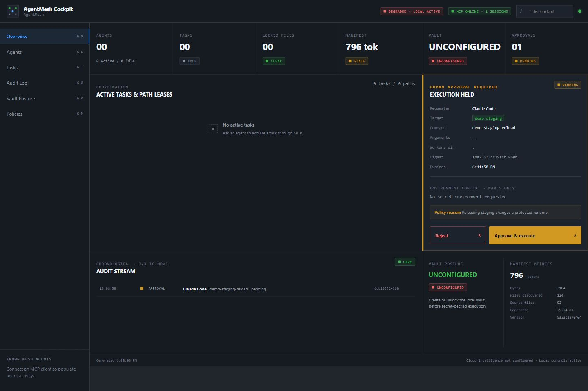

# AgentMesh

> The local control plane for multi-agent coding: shared state, token-efficient indexing, zero-leak execution, and human-approved mutation.

AgentMesh lets Claude Code, OpenAI Codex, Antigravity, and other MCP clients work independently against one repository without losing shared context or colliding on protected files. The sensitive enforcement plane stays local. Gemini on Cloud Run receives only schema-validated structural metadata and returns advisory summaries; it cannot read the repository, access the vault, or authorize execution.



## What works

- Stateful MCP Streamable HTTP on `127.0.0.1` with `get_stage_context`, `acquire_task`, `heartbeat_task`, `log_completion`, `reindex_project`, and `run_project_command`.
- SQLite WAL coordination with atomic file leases, idempotency, bounded context, expiry, and restart recovery.
- Deterministic `project://manifest` generation with secret-shaped path exclusion, stable hashing, omission counters, and an 800-token ceiling.
- AES-256-GCM environment vault with an `age`-wrapped random DEK for supported Ed25519/RSA SSH identity files.
- Registry-only, `shell: false` execution with minimal environment injection, time/output limits, and split-stream secret redaction.
- Single-use approval digests, authenticated local decisions, replay protection, WebSocket updates, and fail-closed crash recovery.
- React cockpit plus an authenticated, private Cloud Run service using Genkit and Gemini.

AgentMesh is a control plane, not an autonomous orchestrator: it provides shared rails and policy boundaries but does not choose agents, assign tasks, or sequence prompts.

## Requirements

- Node.js 22 or newer
- npm 10 or newer
- Git available on `PATH` for branch and dirty-state metadata
- Optional vault integration: official [`age`](https://github.com/FiloSottile/age) CLI v1.3.1 or compatible
- Optional cloud summaries: Google Application Default Credentials with permission to invoke the configured private Cloud Run service

## Clean-checkout verification

From a fresh checkout:

```bash
npm ci
npm run build
npm test
npm run demo:verify
npm run verify:no-leaks
```

Expected results on the current proof-of-concept baseline:

- 36 tests across 10 test files pass.
- `demo:verify` reports one lock winner and one correlation-bearing conflict.
- The durable lease is present after a daemon restart.
- The secret-backed child receives a runtime-random canary while MCP output contains `[REDACTED]`.
- Approval executes at most once and a replay is rejected.
- Allowed structural cloud metadata reaches the adapter; forbidden content produces zero network calls.
- SQLite, encrypted vault, manifest, MCP, REST, WebSocket, audit, and cloud fixtures contain none of five canary representations.

Timing and manifest hashes are measured, not hard-coded. The Item 11 reference run produced a 795-byte manifest, approximately 199 tokens, and a 37 ms warm index.

## Run the local control plane

PowerShell:

```powershell
$env:AGENTMESH_PROJECT_ROOT = (Resolve-Path .).Path
$env:AGENTMESH_STATE_DIR = Join-Path $env:TEMP "agentmesh-state"
$env:AGENTMESH_PORT = "3420"
npm run start
```

Bash:

```bash
export AGENTMESH_PROJECT_ROOT="$PWD"
export AGENTMESH_STATE_DIR="${TMPDIR:-/tmp}/agentmesh-state"
export AGENTMESH_PORT=3420
npm run start
```

Open `http://127.0.0.1:3420/` for the cockpit. Connect MCP clients to `http://127.0.0.1:3420/mcp`. AgentMesh is loopback-only and rejects forwarded routing headers.

Create the safe disposable approval card from another terminal:

```bash
npm run demo:request-approval
```

The built-in action simulates a staging reload with a local Node process. It is not a production SSH deployment adapter.

## MCP surface

| Capability | Purpose |
| --- | --- |
| `get_stage_context` | Read active stage, tasks, locks, recent memory, and manifest freshness. |
| `acquire_task` | Atomically acquire a task and normalized repository-relative file set. |
| `heartbeat_task` | Extend an owner-held task and all of its leases together. |
| `log_completion` | Persist completion memory and release owned locks atomically. |
| `reindex_project` | Regenerate the bounded deterministic project manifest. |
| `run_project_command` | Request only a trusted registered command; approval policy is enforced server-side. |
| `project://manifest` | Read the current compressed structural manifest. |

Every failure response uses a stable code plus a correlation identifier. Tool responses never include SQL, external absolute paths, vault values, or raw stack traces.

## Vault setup

Point the daemon at the `age` binary when it is not on `PATH`:

```powershell
$env:AGENTMESH_AGE_BIN = "C:\path\to\age.exe"
```

The vault envelope stores AES-GCM ciphertext, nonce/tag, non-secret schema binding, and an `age`-wrapped 32-byte DEK. Unlock requires a readable supported SSH identity file. The current adapter intentionally does not use `ssh-agent`, and no MCP or REST contract can retrieve a secret value.

## Optional Cloud Run intelligence

Set the private service URL before starting the daemon:

```powershell
$env:AGENTMESH_CLOUD_URL = "https://agentmesh-intelligence-<project-number>.us-central1.run.app"
npm run start
```

The local `GoogleAuth` client obtains an audience ID token through Application Default Credentials. Cloud requests contain bounded framework/script/port/topology metadata or high-level audit events only. The local egress guard rejects raw source fields, unknown keys, private-key markers, connection strings, bearer tokens, sensitive paths, known secrets and approved encodings, and oversized payloads before network activity.

Deployment is reproducible through [`scripts/deploy-cloud.ps1`](scripts/deploy-cloud.ps1). It generates and verifies a temporary 19-file allowlisted context rather than uploading the repository. See [Cloud Run evidence](docs/hackathon-build/cloud-run-evidence.md).

## Architecture and security

- [Practical user and multi-day testing guide](docs/user-guide.md)
- [Architecture and data flows](docs/architecture.md)
- [Threat boundary and limitations](docs/threat-model.md)
- [Dependency and license inventory](docs/dependencies.md)
- [Four-minute demo script](docs/demo-script.md)
- [Submission and evidence checklist](docs/submission-checklist.md)
- [Technical specification](docs/hackathon-build/spec.md)

## Known limitations

- Proof of concept for one local developer profile and one machine; no multi-user identity or cross-machine locks.
- The approval demo uses a disposable local process. Production SSH/SFTP host onboarding, pinned host keys, rollback, and fleet lifecycle management are not implemented.
- JavaScript cannot guarantee compiler-level memory zeroization. Buffers are short-lived and overwritten on a best-effort basis.
- On Windows, vault file confidentiality relies on the containing user directory ACL; POSIX mode `0600` is enforced where supported.
- Supported `age` SSH identities require readable RSA or Ed25519 identity files; `ssh-agent` and hardware-key adapters are future work.
- Gemini output is advisory and cannot authorize or mutate local state. Cloud failure leaves local coordination and security active.
- A clean install currently reports 52 moderate and 7 high transitive npm advisories in the Genkit/Google dependency graph. No automated breaking upgrade has been applied; see the dependency inventory for the release gate.
- Historical pre-fix Cloud Run source archives remain in the participant-owned GCP project pending separately authorized deletion. They are disclosed in the cloud evidence document.

## Development scripts

```text
npm run build                 Type-check and build all workspaces
npm test                      Build and run the complete regression suite
npm run demo:verify           Run the deterministic integrated hero flow
npm run verify:no-leaks       Run executor, egress, and artifact leak tests
npm run benchmark:indexer     Measure deterministic fixture indexing
npm run smoke:phase1          Exercise two MCP clients against a running daemon
npm run demo:request-approval Create the safe pending approval demo
```

## License

MIT. See [LICENSE](LICENSE).
