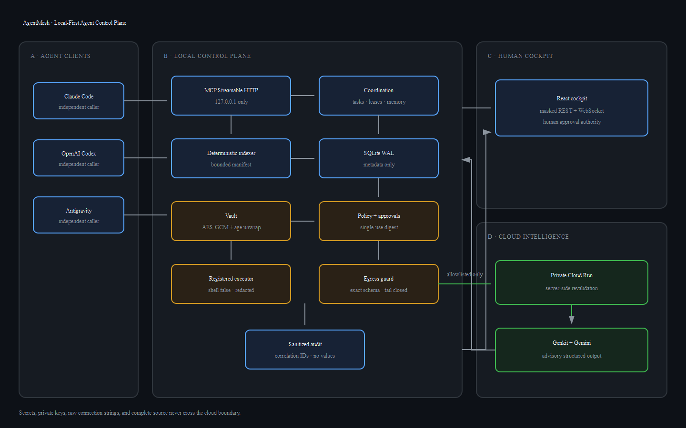

# AgentMesh architecture

The diagram source is [`architecture.mmd`](architecture.mmd). The editable SVG export is [`assets/agentmesh-architecture.svg`](assets/agentmesh-architecture.svg), and the Devpost-compatible 1440×900 upload is [`assets/agentmesh-architecture.png`](assets/agentmesh-architecture.png).

## Trust zones

1. **Independent agents are untrusted callers.** They may request context, leases, and registered execution, but cannot retrieve vault values or bypass policy.
2. **The local daemon is authoritative.** It owns canonical repository paths, SQLite WAL state, indexing, vault state, policy classification, execution, and egress validation.
3. **The cockpit is privileged but secret-free.** It receives only masked environment names, sanitized actions, metadata, and correlation identifiers. Its mutation token is random, process-local, and delivered as an HttpOnly, SameSite=Strict cookie.
4. **Cloud intelligence is advisory.** The private Cloud Run service accepts the same strict request schema as the local guard and has no callback route into the daemon, repository, SQLite database, or vault.

## Important flows

### Task and file ownership

Agent input → Zod boundary validation → repository-relative normalization → `BEGIN IMMEDIATE` → conflict check → task/lock/memory commit → bounded MCP context → heartbeat, expiry, or completion release.

### Secret-backed execution

Encrypted vault → local `age` identity unwrap of the random DEK → AES-256-GCM authentication/decryption in process memory → registered child environment → streaming raw/encoded secret redaction → sanitized MCP/audit projection → best-effort buffer cleanup.

### Approval

Registered command → policy classification → canonical SHA-256 action digest → pending cockpit card → one authenticated decision → approve-before-execute transition → terminal result. Expired, replayed, modified, or restart-ambiguous actions fail closed.

### Cloud summary

Canonical manifest/audit metadata → exact local schema → known-secret/pattern/size scan → metadata-only audit row → authenticated private Cloud Run request → server-side revalidation → Genkit/Gemini structured summary → advisory labeled UI result.

## Deployment split

The local daemon, dashboard, tests, vault, and repository source are not part of the cloud deployment context. `scripts/deploy-cloud.ps1` constructs an allowlisted 19-file staging directory containing only build metadata plus the contracts and cloud-service source, verifies the exact list, deploys it, and deletes the temporary directory.
