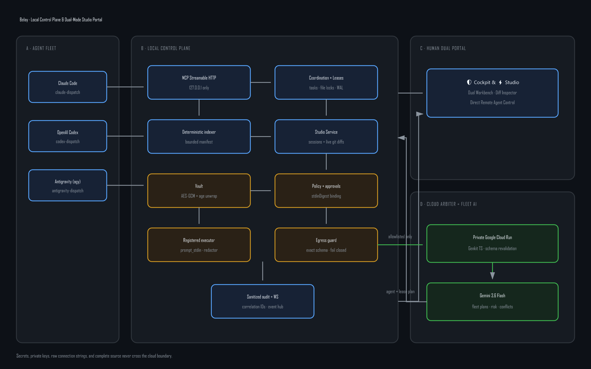

# Belay architecture

The diagram source is [`architecture.mmd`](architecture.mmd). The editable SVG export is [`assets/belay-architecture.svg`](assets/belay-architecture.svg), and the Devpost-compatible 1440×900 upload is [`assets/belay-architecture.png`](assets/belay-architecture.png).

## Trust zones

1. **Independent agents are untrusted callers.** They may request context, leases, and registered execution, but cannot retrieve vault values or bypass policy.
2. **The local daemon is authoritative.** It owns canonical repository paths, SQLite WAL state, indexing, vault state, policy classification, command execution, Studio session persistence, Git diffs, and egress validation.
3. **The portal (🛡️ Cockpit & ⚡ Studio) is privileged but secret-free.** It receives only masked environment names, sanitized actions, metadata, and correlation identifiers. Its mutation token is random, process-local, and delivered as an HttpOnly, SameSite=Strict cookie. Studio adds touch-friendly prompt dispatching and unified Git diff inspection.
4. **Gemini is the Cloud Arbiter and Fleet Intelligence Engine.** The private Google Cloud Run service accepts the same strict request schemas as the local guard and has no callback route into the daemon, repository, SQLite database, or vault. Genkit TypeScript and Gemini 3.6 Flash provide pre-execution fleet task decomposition, lease-topology assignment, live lock-conflict adjudication, and risk explanations. All output remains advisory until the local SQLite-WAL authority validates and enforces it.

## Important flows

### Task and file ownership

Agent input → Zod boundary validation → repository-relative normalization → `BEGIN IMMEDIATE` → conflict check → task/lock/memory commit → bounded MCP context → heartbeat, expiry, or completion release.

### Shared workflow state

Checklist proposal → dependency validation → pending item → atomic task acquisition and item claim → idempotent progress events → completion with verification evidence, or blocker transition with lock release. The bounded checklist is returned separately from recency-based activity memory so pending work cannot disappear behind newer events.

### Shared semantic knowledge

Agent proposal → project/workspace scope resolution → collision and supersession validation → canonical payload digest → pending cockpit card → authenticated human decision → atomic fact publication and prior-fact retirement. Only active approved rows enter the separately budgeted pinned context block; pending, rejected, and superseded rows remain outside agent context.

### Secret-backed execution

Encrypted vault → local `age` identity unwrap of the random DEK → AES-256-GCM authentication/decryption in process memory → registered child environment → streaming raw/encoded secret redaction → sanitized MCP/audit projection → best-effort buffer cleanup.

### Approval

Registered command or knowledge proposal → canonical SHA-256 action digest → pending cockpit card → one authenticated decision → approve-before-execute/publish transition → terminal result. Expired, replayed, modified, or restart-ambiguous actions fail closed.

### Cloud summary

Canonical manifest/audit metadata → exact local schema → known-secret/pattern/size scan → metadata-only audit row → authenticated private Cloud Run request → server-side revalidation → Genkit/Gemini structured summary → advisory labeled UI result.

### Fleet task decomposition

High-level Workbench goal → bounded AST manifest projection → exact local egress schema and secret scan → authenticated `POST /v1/decompose-fleet-task` → Cloud Run server-side revalidation → Genkit structured Gemini plan → local agent/path allowlist validation → labeled Workbench task/lease topology → existing SQLite-WAL acquisition gate before execution.

## Deployment split

The local daemon, dashboard implementation, tests, vault, and repository source are not part of the cloud deployment context. `scripts/deploy-cloud.ps1` constructs an allowlisted 21-file staging directory containing only build metadata plus the contracts and cloud-service source, verifies the exact list, deploys it, and deletes the temporary directory.
